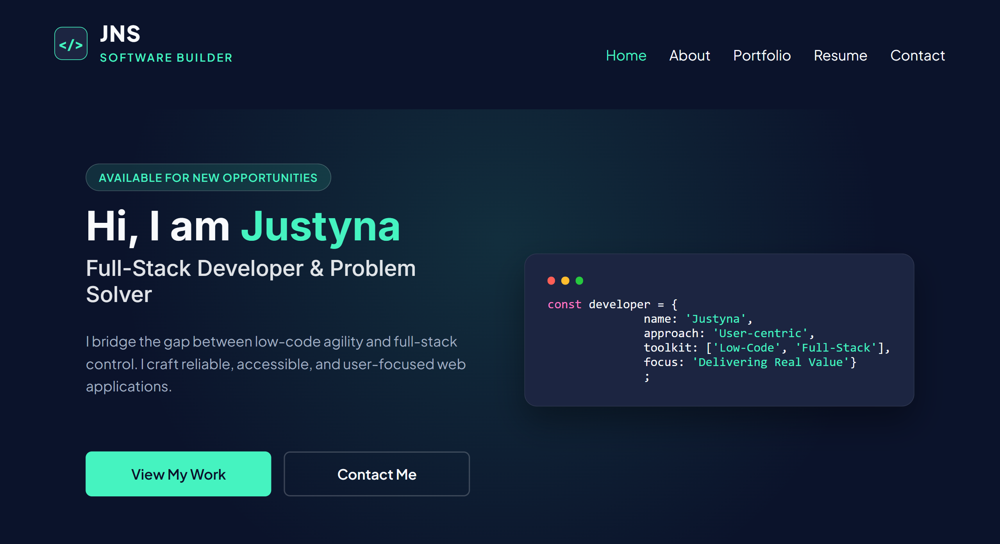
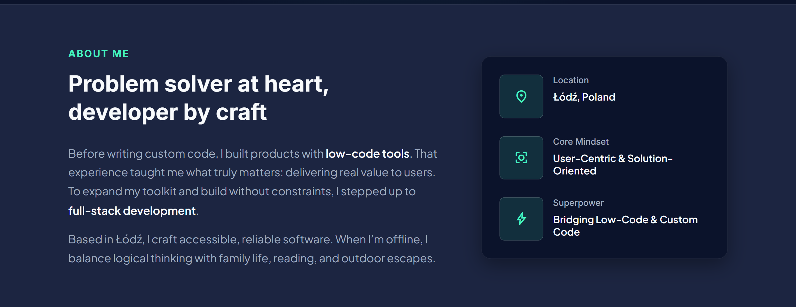
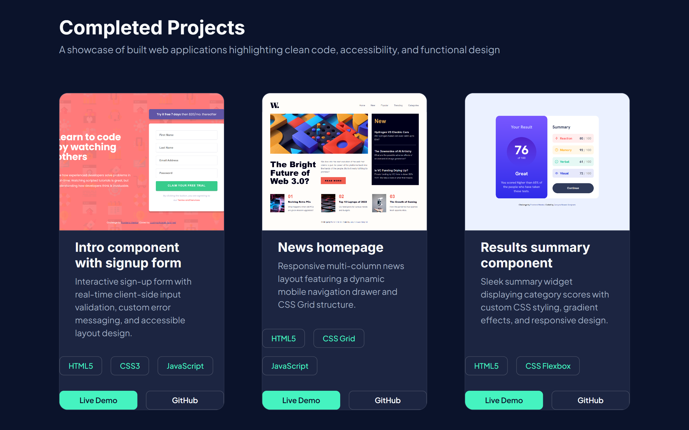
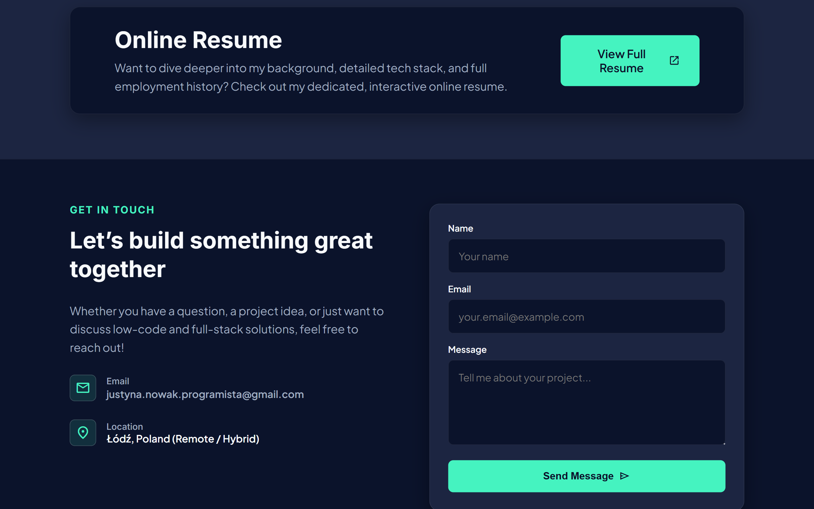
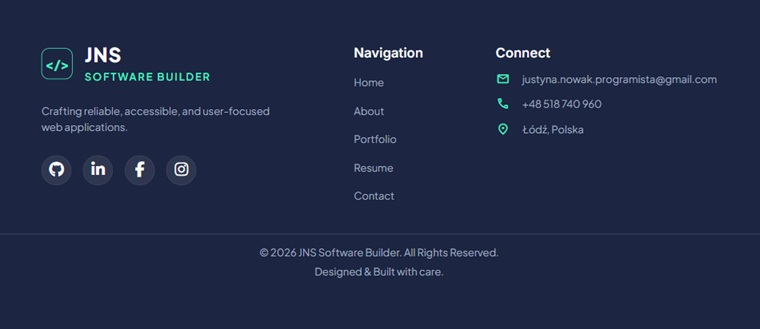

# Personal Portfolio & Software Builder Landing Page

This is a solution/repository for my personal developer portfolio website. It showcases my transition from low-code agility to full-stack control, featuring responsive layouts, semantic HTML, and high accessibility standards.

## Table of contents

- [Overview](#overview)
  - [The challenge](#the-challenge)
  - [Screenshot](#screenshot)
  - [Links](#links)
- [My process](#my-process)
  - [Built with](#built-with)
  - [What I learned](#what-i-learned)
  - [Continued development](#continued-development)
- [Author](#author)

---

## Overview

### The challenge

Users should be able to:

- View the optimal layout for the site depending on their device's screen size (Responsive Design).
- Navigate through all interactive elements using keyboard navigation alone (`:focus-visible` states).
- Open and close the mobile navigation drawer smoothly with keyboard/touch support (`aria-expanded` & `Escape` key handling).
- Submit a structured contact form with client-side validation.
- View accessible project cards with descriptive alt tags and direct links to live demos and GitHub repositories.

### Screenshot

#### Desktop view
* **Navigation and  Hero Section:**
 
* **About Section:**
 
* **Portfolio Section:**
 
* **Resume and Contact Section:**
 
* **Footer Section:**
 


### Links

- **Solution URL:** [GitHub Repository](https://github.com/Jusnow1608/personal-website) 
- **Live Site URL:** [Live Demo](https://jusnow1608.github.io/personal-website/)

---

## My process

### Built with

- **Semantic HTML5 markup** (Header, Main, Section, Article, Footer)
- **CSS Custom Properties** (Design tokens for dark mode theme, colors, glows)
- **Flexbox & CSS Grid** (Layout management and project grid)
- **Fluid Typography & Spacing** (`clamp()` functions for responsive scaling)
- **Mobile-first workflow**
- **Vanilla JavaScript** (A11y navigation, state management, dynamic year)

### What I learned

During this project, I focused heavily on web accessibility (A11y), clean code practices, and responsive design patterns. 

1. **Accessible Mobile Navigation:**
   Synchronizing screen reader state (`aria-expanded`) and handling keyboard interactions like closing the menu on `Escape` key press:

   ```js
   document.addEventListener('keydown', (e) => {
     if (e.key === 'Escape' && navToggle.checked) {
       navToggle.checked = false;
       navToggle.setAttribute('aria-expanded', 'false');
       navToggle.focus();
     }
   });
   ```
2. **Fluid Typography with clamp():**
Instead of using multiple media query breakpoints for font sizes, I implemented CSS functions for fluid scaling:

```CSS
--font-h1: clamp(2rem, 1.4rem + 2.8vw, 3.25rem);
--font-base: clamp(1rem, 0.95rem + 0.25vw, 1.125rem);
```
3. **User Motion Preference:**
Respecting system settings for reduced motion to ensure a comfortable viewing experience for all users:

```CSS
@media (prefers-reduced-motion: reduce) {
  *, *::before, *::after {
    animation-duration: 0.01ms;
    transition-duration: 0.01ms;
  }
}
```
### Continued development
In future projects, I plan to:

Expand my full-stack capabilities by integrating backend services / serverless API endpoints for the contact form.

Experiment with subtle micro-interactions using modern CSS animation techniques.

Explore advanced frontend frameworks like React or Next.js to expand my toolkit.

### Author
- GitHub - [@Jusnow1608](https://github.com/Jusnow1608)
- Frontend Mentor - [@Jusnow1608](https://www.frontendmentor.io/profile/Jusnow1608)
- LinkedIn - [@Justyna-Nowak-Szrajnert](https://www.linkedin.com/in/justyna-nowak-szrajnert-a5168713b/)