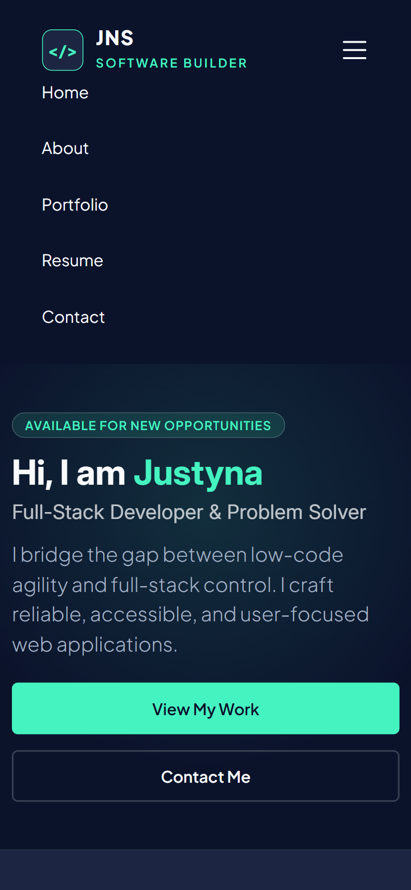
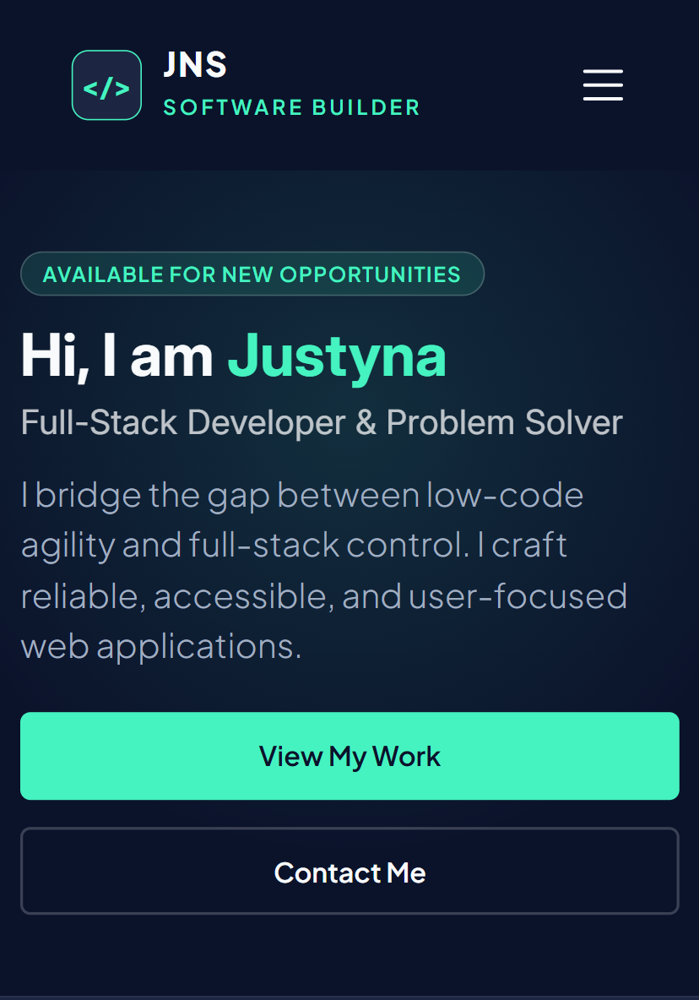
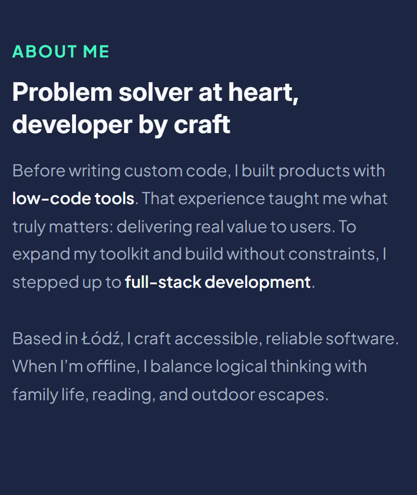
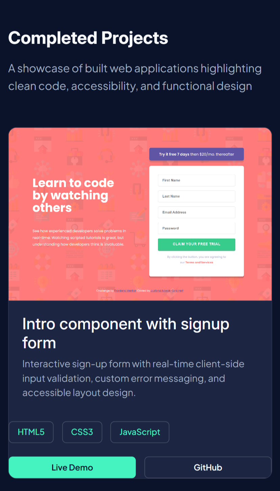
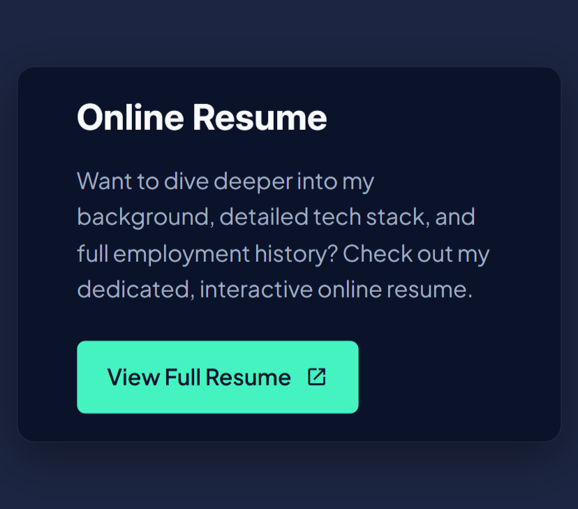
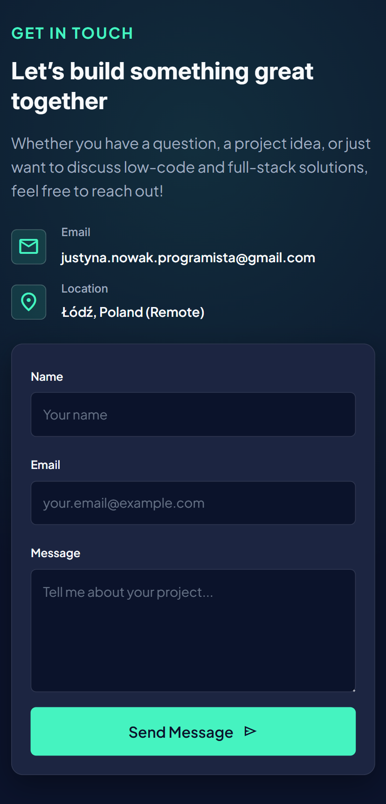
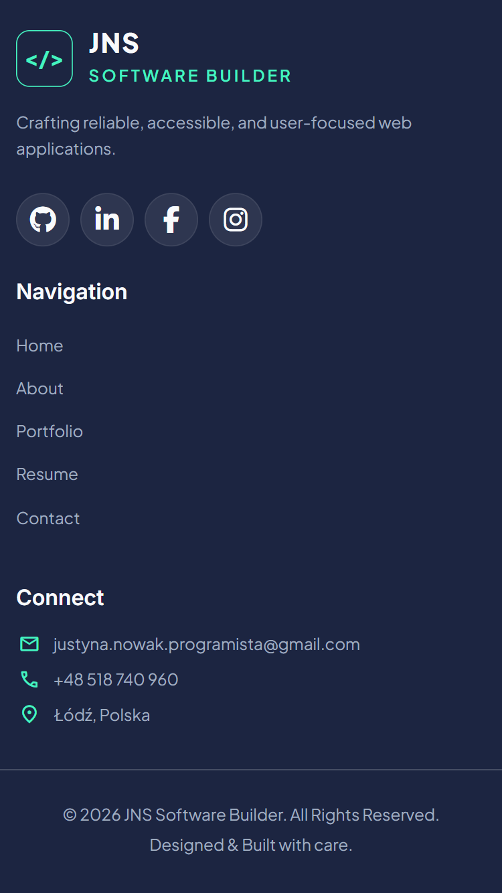
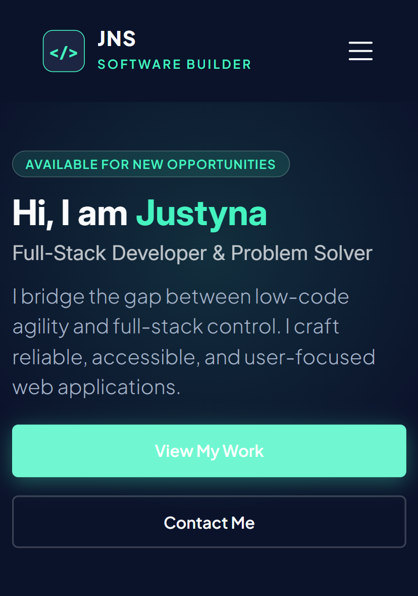
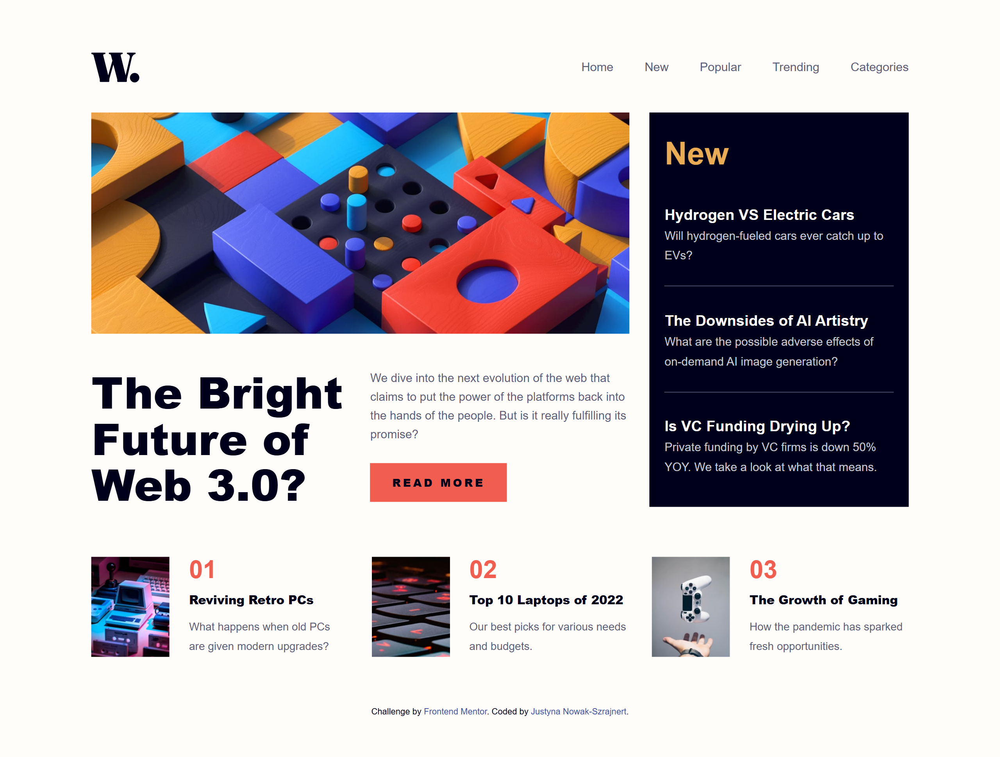

# Personal Portfolio & Software Builder Landing Page

This is a repository for my personal developer portfolio website. It showcases my transition from low-code agility to full-stack control, featuring responsive layouts, semantic HTML, and high accessibility standards.

## Table of contents

- [Overview](#overview)
  - [The challenge](#the-challenge)
  - [Refactoring Highlights](#refactoring-highlights)
  - [Screenshot](#screenshot)
  - [Links](#links)
- [My process](#my-process)
  - [Built with](#built-with)
  - [What I learned](#what-i-learned)
  - [Continued development](#continued-development)
- [Author](#author)

---

## Overview

### The challenge

Users should be able to:

- View the optimal layout for the site depending on their device's screen size (Responsive Design).
- Navigate through all interactive elements using keyboard navigation alone (`:focus-visible` states & proper focus management).
- Open and close the mobile navigation drawer smoothly with keyboard/touch support (`aria-expanded` & `Escape` key handling).
- Experience fast page loads with optimized fonts, preconnect links, and lazy-loaded project images to prevent Cumulative Layout Shift (CLS).
- Submit a structured contact form with client-side validation.
- View accessible project cards with descriptive alt tags and direct links to live demos and GitHub repositories.

### Refactoring Highlights

In the latest code refactor, several key optimizations were implemented across HTML, CSS, and accessibility:

- **Performance & Asset Loading:** Added `preconnect` hints for Google Fonts and implemented `loading="lazy"` with explicit image aspect dimensions (`width`/`height`) on portfolio cards to reduce layout shifts and boost performance metrics.
- **Accessibility (A11y) & ARIA:** Added distinct `aria-label` attributes to distinguish primary and footer `<nav>` landmark regions for screen readers, and marked decorative UI code-card dots with `aria-hidden="true"`.
- **CSS Code Quality & Consistency:** Standardized layout properties using **CSS Logical Properties** (`border-block-start`, `margin-block-end`), cleaned up unused variables/rules, and verified WCAG color contrast ratios.
- **Typography & Motion:** Integrated multi-font support (`Inter`, `Plus Jakarta Sans`, and `Fira Code` for developer code cards) alongside fluid responsive sizing via `clamp()`.

### Screenshot

#### Desktop view
* **Navigation and  Hero Section:**
 
* **About Section:**
 
* **Portfolio Section:**
 
* **Resume and Contact Section:**
 
* **Footer Section:**
 

#### Mobile view
* **Navigation Section:**
 
* **Navigation and  Hero Section:**
 
* **About Section:**
 
* **Portfolio Section:**
 
* **Resume Section:**
 
* **Contact Section:**
 
* **Footer Section:**
 

#### Active states & Hover Effects
* **Active Button:**
 

### Links

- **Solution URL:** [GitHub Repository](https://github.com/Jusnow1608/personal-website) 
- **Live Site URL:** [Live Demo](https://jusnow1608.github.io/personal-website/)

---

## My process

### Built with

- **Semantic HTML5 markup** (Header, Main, Section, Article, Nav, Footer with landmark labels)
- **Bootstrap 5.3 & Custom CSS** (Utility classes extended with scoped custom styles)
- **CSS Custom Properties** (Design tokens for dark mode theme, colors, glow effects, design spacing)
- **CSS Logical Properties** (`border-block-start`, `padding-inline`, `margin-block-end`) for modern layouts
- **Flexbox & CSS Grid** (Layout management and project grid)
- **Fluid Typography & Spacing** (`clamp()` functions for responsive scaling)
- **Mobile-first workflow**
- **Vanilla JavaScript** (A11y navigation, state management, dynamic year calculation)

### What I learned

During this project, I focused heavily on web accessibility (A11y), clean code practices, and responsive design patterns. 

1. **Performance Optimization with Resource Hints & Image Lazy Loading:**
   Adding `preconnect` tags speeds up critical font loading, while explicit image dimensions combined with native lazy loading prevent Cumulative Layout Shift (CLS):

   ```html
   <link rel="preconnect" href="[https://fonts.googleapis.com](https://fonts.googleapis.com)">
   <link rel="preconnect" href="[https://fonts.gstatic.com](https://fonts.gstatic.com)" crossorigin>

   
    ```
2. **Differentiating Landmark Regions for Accessibility:**
When multiple navigation bars exist on a page (e.g., header and footer), specifying explicit aria-label tags helps assistive technologies like screen readers distinguish between them:

```HTML
<!-- Header Primary Navigation -->
<nav class="navbar navbar-expand-lg" aria-label="Main navigation">

<!-- Footer Navigation -->
<nav class="footer-nav" aria-label="Footer navigation">
```

3. **Fluid Typography with clamp():**
Instead of using multiple media query breakpoints for font sizes, I implemented CSS functions for fluid scaling:

```CSS
:root {
--font-h2: clamp(1.5rem, 1.2rem + 1.5vw, 2.25rem);
--font-base: clamp(1rem, 0.95rem + 0.25vw, 1.125rem);
--space-md: clamp(1.25rem, 1rem + 1vw, 2rem);
}

#about {
  background-color: var(--bg-card);
  border-block-start: 0.0625rem solid var(--border-subtle);
}
```

3. **User Motion Preference:**
Respecting system settings for reduced motion to ensure a comfortable viewing experience for all users:

```CSS
@media (prefers-reduced-motion: reduce) {
  *, *::before, *::after {
    animation-duration: 0.01ms;
    animation-iteration-count: 1;
    transition-duration: 0.01ms;
    scroll-behavior: auto;
  }
}
```
### Continued development
In future projects, I plan to:

Expand my full-stack capabilities by integrating backend services / serverless API endpoints for the contact form.

Implement automated testing (e.g., Playwright / Cypress for E2E testing and Axe-core for automated WCAG accessibility audits).

Explore advanced frontend frameworks like React or Next.js to expand my developer toolkit while retaining strong core Web Standards.

### Author
- GitHub - [@Jusnow1608](https://github.com/Jusnow1608)
- Frontend Mentor - [@Jusnow1608](https://www.frontendmentor.io/profile/Jusnow1608)
- LinkedIn - [@Justyna-Nowak-Szrajnert](https://www.linkedin.com/in/justyna-nowak-szrajnert-a5168713b/)